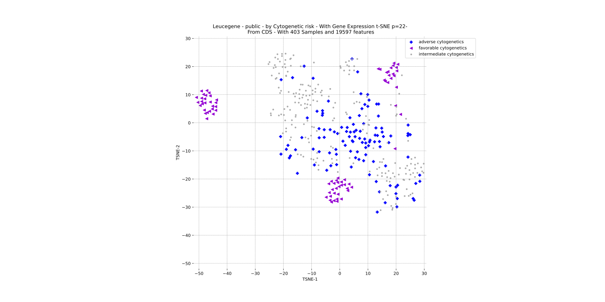
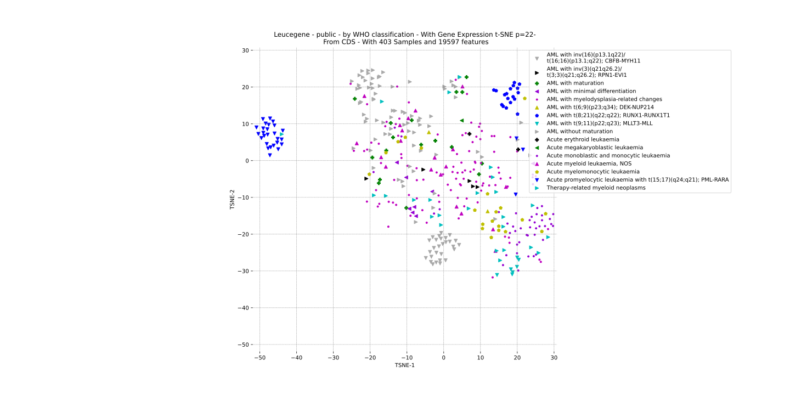
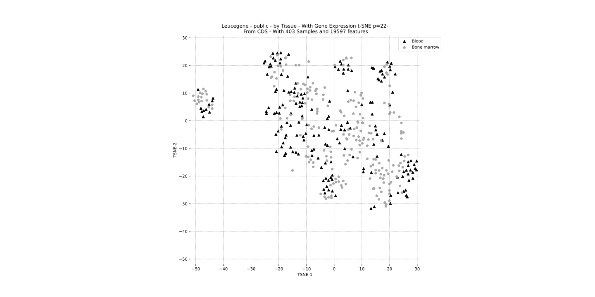
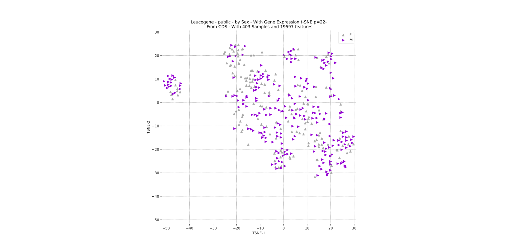
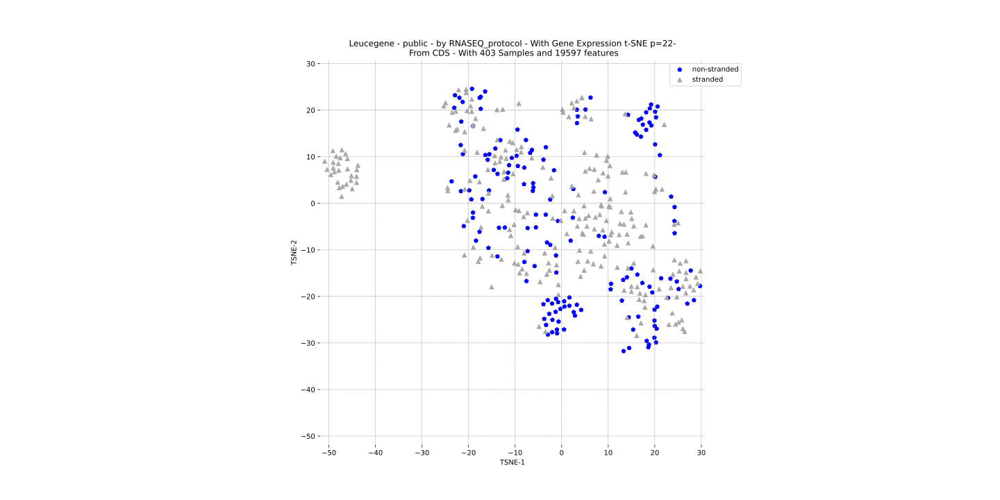
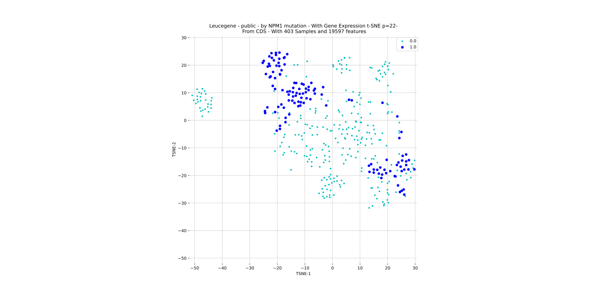
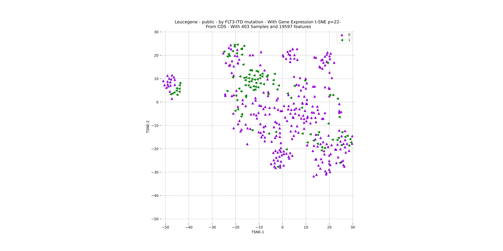
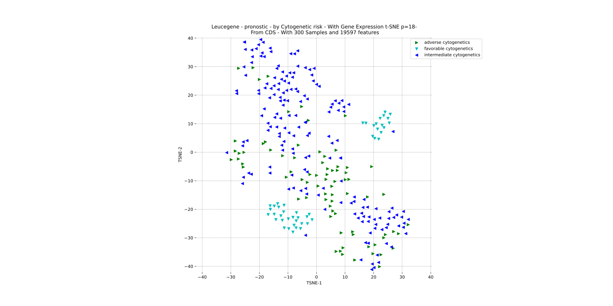
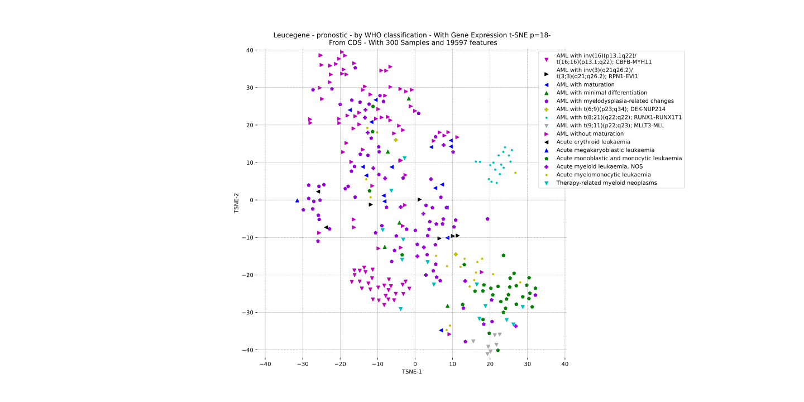

# Visualizations of the Leucegene dataset with dimensionality reduction

## 1. Introduction
In this report, we will investigate a subset of Gene Expression profiles coming from the Leucegene dataset. We will use both PCA, and t-SNE to perform dimensionality reduction on the data. This will provide visualizations of the data as well as highlighting putative cancer subgroups by eye. By correlating the most contributing genes to the PCA, we will assign each PC to a major ontology if it exists. 

## 2. Generating the Data

To run the program, run :
```{python3}
python3 main.py 
```
The other commands will be explained.

### 2.1 Load data

* Loads in data
* Filter by CDS
* Performs TPM normalization

#### 2.1.1 Dumping outputfiles.
Allows faster retrieval of data tables over time and to also write the results it generated to disk. Output files, directories and filenames are generated automatically. 

* Writes every intermediate files during the loading sequences
* Writes results 

#### 2.1.2 Inspect base stats on data
***NOT YET IMPLEMENTED***
This will provide some basic stats of the data features a.k.a. the matrix of gene counts and the matrix of clinical features. 

```{python}
python3 main.py -INFO
with -O: outfiles
else: terminal
```

### 2.2 Datasets

### 2.1 Control over samples subset
```
name: cohort
flag: -C
type: str
values: ["public", "pronostic"]
default values: ["public", "pronostic"]
```
* "public" : The Leucegene public subset = 403 samples. Curated samples subset to complete different feature prediction on.  
* "pronostic" : The Leucegene pronostic subset = 300 samples. Curated samples subset that was selected to perform survival analysis on. 

### 2.2 Control over dimension of the features input space   
* TRSC: The Leucegene full transcriptome =  transcripts
* CDS: The Leucegene Coding transcriptome (22K coding sequences) 

The command:
```{python}
name: width
flag: -W
type: str
values: ["CDS", "TRSC"]
default values: ["CDS", "TRSC"]
```

### 2.3 PCA 
```{bash} 
flag: -PCA
```
Performs Principal Component Analysis on Leucegene Public, then writes output to file.
1. [Principal Components Analysis (PCA)](https://en.wikipedia.org/wiki/Principal_component_analysis) (n_components = #samples)
2. **PCA Projection:** Performs gene count transformation on the PCs. This provides a dimensionality reduction if needed.  
3. Writes the loadings and the projection to file. 

```{python}
python3 main.py -PCA
default: OFF
```

### 2.4 Retrieving most contributing genes to Principal Components

 
```{bash} 
flag: -GO
default: OFF
```
* Loads PCA loadings if they exist, else run PCA
* Correlates each gene contribution to PC with loadings
* Selects top 10 genes for each PC 
* Performs Gene Ontology Enrichment analysis for each of the PC's top 10 gene set
* Writes in table format 

```{python}
python3 main.py -PCA -GO
```

### 2.5 t-SNE on Leucegene Public with Clinical Features Annotations

#### 2.5.1 Running t-SNE (1 replicate, random perplexity)
* Dataset suffled (default)
* PCA reduction is applied (250 PCs)
* Random perplexity is picked in range [15,30]
* Performs 2D t-SNE transformation on PCA of GE matrix

```{python}
python3 main.py -TSNE
default: OFF
```

#### 2.5.2 Running t-SNE with N replicates
* Random perplexity is picked within range [15, 30]
* For each replicate: 
    * dataset is suffled 

```{python}
python3 main.py -TSNE
default: OFF
```


### 2.6 Plot Results 

* Loads in the PCA, t-SNE data if they exist, else performs PCA and T-SNE analyses. 
* Outputs a scatterplot BY **each feature** for  
    * PCA PC_X vs PC_Y | X,Y < 10 projections  
    * 2D t-SNE 

```{python}
python3 main.py -PCA -TSNE -PLOT
```

### 2.7 Automatic feature detection with Supervised Machine Learning 
pending...

## 3. Discussion
### 3.1 Most contributing genes correlation to PC and GO enrichment
We investigate the first 3 components and retrieve the most contributing genes with highest correlation. Output is a table for each PC the 10 most contributing genes. Each column 

#### Table
PC# | GO enrichment
---|---
1 | x
2 | x
3 | x

### 3.2 t-SNE on 20K transcriptome with Clinical Features

#### 3.2.1 Leucegene *public* comparing selected features
[figure](https://bioinfo.iric.ca/~sauves/LEUCEGENE/RES2021/RES2021083116:06:23.670204/public/CDS/lgn_public_GE_TSNE_CDS_TPM_Cytogenetic%20risk.svg)


[figure](https://bioinfo.iric.ca/~sauves/LEUCEGENE/RES2021/RES2021083116:06:23.670204/public/CDS/lgn_public_GE_TSNE_CDS_TPM_WHO%20classification.svg)


[figure](https://bioinfo.iric.ca/~sauves/LEUCEGENE/RES2021/RES2021083116:06:23.670204/public/CDS/lgn_public_GE_TSNE_CDS_TPM_Tissue.svg)


[figure](https://bioinfo.iric.ca/~sauves/LEUCEGENE/RES2021/RES2021083116:06:23.670204/public/CDS/lgn_public_GE_TSNE_CDS_TPM_Sex.svg)


[figure](https://bioinfo.iric.ca/~sauves/LEUCEGENE/RES2021/RES2021083116:06:23.670204/public/CDS/lgn_public_GE_TSNE_CDS_TPM_RNASEQ_protocol.svg)


[figure](https://bioinfo.iric.ca/~sauves/LEUCEGENE/RES2021/RES2021083116:06:23.670204/public/CDS/lgn_public_GE_TSNE_CDS_TPM_NPM1%20mutation.svg)


[figure](https://bioinfo.iric.ca/~sauves/LEUCEGENE/RES2021/RES2021083116:06:23.670204/public/CDS/lgn_public_GE_TSNE_CDS_TPM_FLT3-ITD%20mutation.svg)


#### 3.2.1 Leucegene *pronostic* comparing selected features

[figure](https://bioinfo.iric.ca/~sauves/LEUCEGENE/RES2021/RES2021083116:06:23.670204/pronostic/CDS/lgn_pronostic_GE_TSNE_CDS_TPM_Cytogenetic%20risk.svg)


[figure](https://bioinfo.iric.ca/~sauves/LEUCEGENE/RES2021/RES2021083116:06:23.670204/pronostic/CDS/lgn_pronostic_GE_TSNE_CDS_TPM_WHO%20classification.svg)
